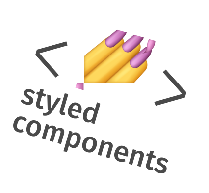
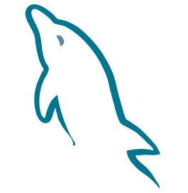

<h1 align="center">
  &lt;Hello There!/&gt;
</h1>

  <h3> Eu sou o Miguel Retroz, seja bem vindo(a) ao meu perfil. </h3>

`💻 Tenho como foco desenvolver e melhorar minhas habilidades como programador, buscando sempre novos aprendizados e experiências.`

`📖 Atualmente sou estudante de desenvolvimento de software pela Trybe, onde dia após dia venho me aprimorando.`

##

  

 

<a href="#" align="center">
  

    
      
  

</a>

 

<h2 align="center">
&lt;Tecnologias/&gt;
</h2>

  
  
  
  
  
  
  

  <h3 align="center">
  Front-end
  </h3>
  
  
  
  
  
  
  

  <h3 align="center">
  Back-end
  </h3>
  
  
  
  

##

  
  
  
  

  <h4>
  
  Que a força esteja com você!
  
  </h4>

